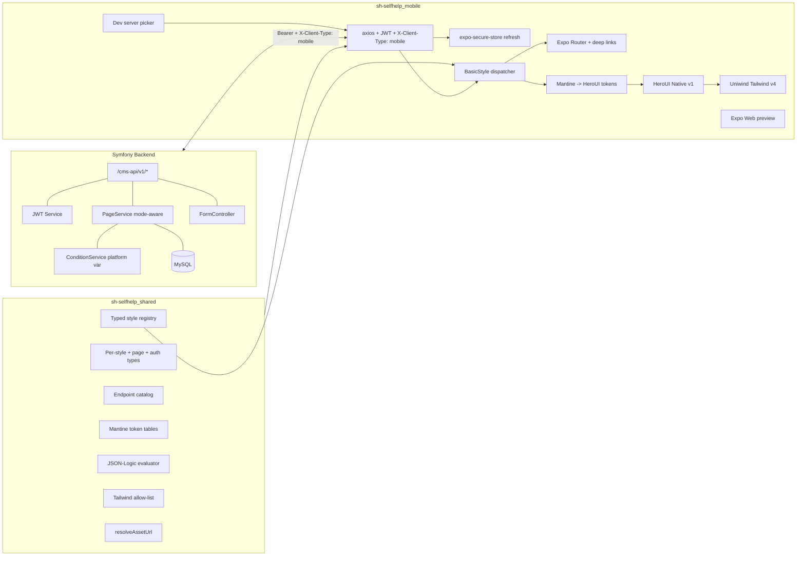
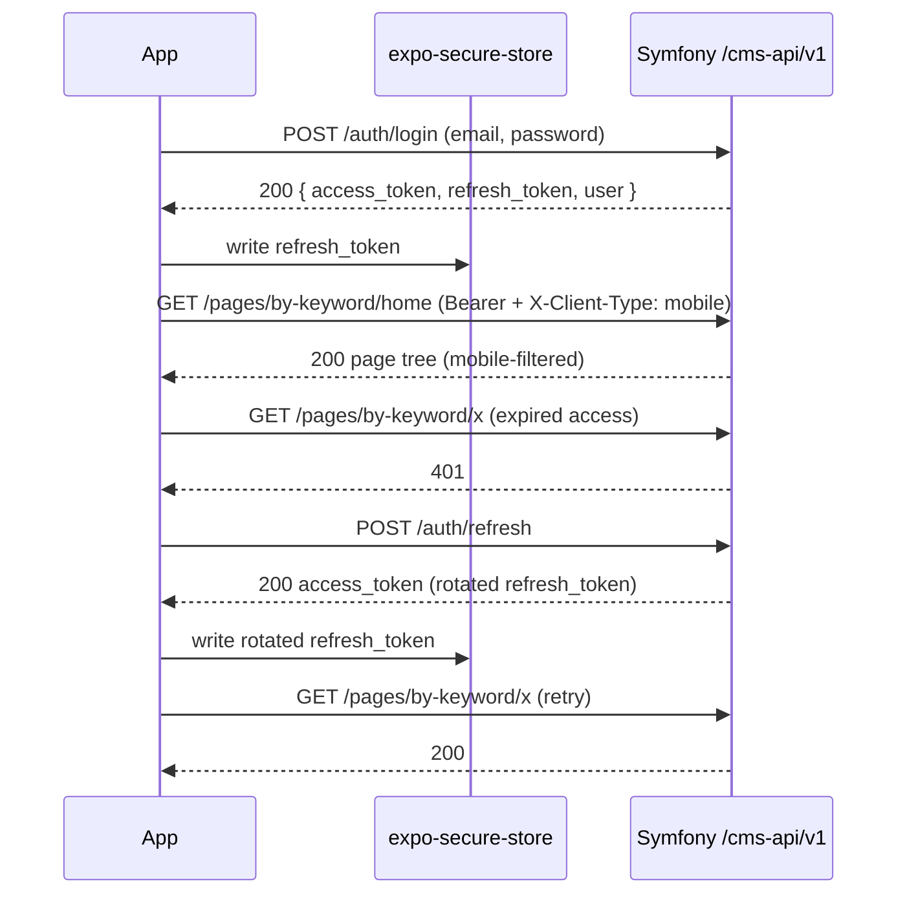

# Architecture

How the mobile app, backend, and shared package fit together.

## High-level diagram

## Request flow

## Layers

1. **Providers** (`providers/`) — `ErrorBoundary`, `ServerProvider`, `QueryProvider`, `I18nProvider`, `ThemeProvider`, `AuthProvider`, `NativeBootstrap`. Composed by `AppProviders.tsx`. They run in this order so that, e.g., `AuthProvider` always sees the configured base URL.
2. **Stores** (`stores/`) — Zustand: `serverStore` (URL), `authStore` (access token + user), `languageStore` (locale + available languages).
3. **Services** (`services/`) — typed wrappers around the API: `apiClient.ts` (singleton axios), `pageService.ts`, `formsService.ts`, `authService.ts`, `languageService.ts`, `secureStore.ts`.
4. **Hooks** (`hooks/`) — TanStack Query wrappers: `usePageContent`, `useLanguages`, `useFormSubmit`.
5. **Renderer** (`components/renderer/`) — `PageRenderer` walks the page tree, evaluates `condition`, runs `{{field}}` interpolation, and dispatches each section to a registered style component via `BasicStyle`. `UnknownStyle` and `DebugWrapper` give safe fallbacks.
6. **Styles** (`components/styles/`) — One folder per CMS style group (layout, typography, media, interactive, forms, composite, auth). The map from `style_name → React component` lives in `components/styles/index.ts`.
7. **Native** (`native/`) — Expo modules: notifications, deep links, permissions, audio recorder, OTA updates, device service.

## Page rendering pipeline

For every section in the tree:

1. **Condition** — `evaluateCondition` from the shared package runs JSON-Logic with the context `{ platform: 'mobile', language, current_date, ... sectionVars }`. Falsy → skip.
2. **Interpolation** — every `{{field}}` placeholder is resolved via `replaceCalcedValues` against the page's value map.
3. **Class string** — `buildSectionClasses(section)` parses `css_mobile`, runs each token through the shared allow-list + remap, and joins the survivors. Unsupported tokens are dropped + warned in `__DEV__`.
4. **Theme props** — Mantine semantic props (`mantine_size`, `mantine_color`, `mantine_radius`, `mantine_spacing_margin_padding`, `mantine_variant`) are mapped to HeroUI props by the helpers in `styles/`.
5. **Render** — the registered HeroUI Native impl receives `{ section, values }`. Children (when present) are recursively rendered through `<Children>`.

## State + cache

- TanStack Query with `createAsyncStoragePersister` persists page caches across cold starts so the home page loads instantly while a fresh fetch runs in the background.
- Auth state is in-memory (`accessToken`) + SecureStore (`refresh_token`) so a phone reboot doesn't kick the user out, but a memory dump can't reveal the access token.

## Related docs

- [setup.md](setup.md) — install + first run.
- [server-selection.md](server-selection.md) — multi-tenant strategy.
- [styling/cms-classes.md](styling/cms-classes.md) — CMS Tailwind allow-list + remap.
- [cookbook/add-style.md](cookbook/add-style.md) — extending the renderer.
